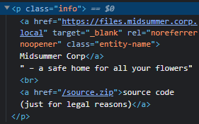
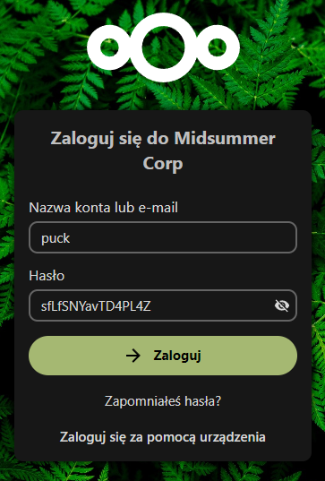
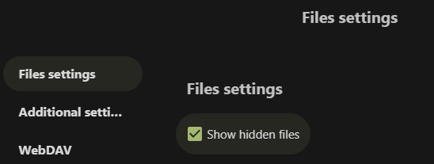

[[ 🡅 Move up ]](../)</br>
**01: Puck** [[ Next 🡆 ]](../02_Leshy/)

# ☆ Puck, the Intern ☆

> Responsible for creating chaos and confusion to distract people from the company's true intentions.

## Exploitation

### Briefing

> Authentication is the process of verifying the identity of a user or a system, typically for the purpose of granting access to a particular resource or service. It involves verifying that a claimed identity is genuine and accurate and ensuring that a user or a system has the appropriate credentials to access the requested resource. While password authentication is the best-known authentication factor, there are others. They are typically classified as: 
> - Something you know (a password or a PIN) 
> - Something you have (a smartphone or a U2F security key) 
> - Something you are (the way your veins are laid out on your palm, iris and retina characteristics)
>
> </br>
> When implementing an authentication process, many mistakes can be made. Also, relying on a single factor can be risky. In such a case, if someone knows your password... no vulnerability is needed to impersonate a victim. 
>
> </br>
> Puck hasn't been very careful, and his credentials could be buried somewhere in the application. 

**Prerequisites**: None. </br>
**Your objective**: Find a way to log in to the `puck` account. Password brute-force is not required. 

### Reconnaissance
After navigating to the web app we are presented with the login page allowing us to choose between a traditional login + password method or Single Sign On method.


Keen eye might see some text on the bottom - although it can't be highlighted by selection, we can use browser DevTools to easily see its contents.



We get two pieces of information from this paragraph alone:
- Base URL of the site, which is `https://files.midsummer.corp.local`
- **Access to the source code of the application** (without configuration files)

Whether the first one will prove useful in the future is hard to tell, access to source code always gives a huge boost since you can understand how the app works and find the Attack Vector more easily.

Back on track - Briefing included information about Puck being careless and burying his login credentials somewhere in the application - checking the source code of the login page should be a good place to start. It's messy, but searching for anything containing the string `password` yields us interesting results:

```Javascript
var oc_appconfig = { /* ... */ "defaultPassword":"s[...]Z" /* ... */ };
```

### Attack Vector

Exposed server-side secret on client-side application

### Execution

We will use the default user password buried in the client-side web application to access `puck` account.

On the login page we will choose the traditional method, entering `puck` as account name and our newly found default password as password.



Lo and behold, we successfully gained access to Puck's account. Wasn't so hard after all, eh?

## Prevention

Never expose server-side secrets on client-side application. Even if it's something as simple as a default user password, it's a huge red flag if secrets like this leak into the client-side.

Easiest way to prevent secret leaking is to load them in as Environment Variables, instead of hard-coding them into application. Not only does it provide us with the luxury of all critical pieces of information, such as API keys or defaults, being contained in one place, but also assuming the worst-case scenario, end user might see something like

```Javascript
var adminPassword = process.env.ADMIN_PASSWORD;
```

instead of

```Javascript
var adminPassword = "admin123";
```

which is already a huge plus.

To investigate the secret keeping and get to know more complex (and secure) solutions, check out this article: [Storing secrets in web applications using vaults](https://www.securing.pl/en/storing-secrets-in-web-applications-using-vaults/).

## Tasks

### What is the content of the file Fern_flower_ritual_shard1.txt in Puck's account?

<details>
<summary>Fern_flower_ritual_shard1.txt</summary>

`Midsummer_Corp{W@it_unt!1_m1dn1ght_0n_th3_Summ3r_Solst1c3}`

</details>

As is the case with every account, once we log into it we are able to navigate through the files stored on that account. There are two notable files present on every account:
- `Fern_flower_ritual_shard[n].txt` - contains the flag for this stage
- `fernflower_flag[n].png` - n<sup>th</sup> piece of the final puzzle


### Who is going on vacation? Please provide their email address.

<details>
<summary>Answer</summary>

`leshy@midsummer.corp.local`

</details>

After accessing Puck's account we can notice a text on the bottom of file display saying `2 folders and 25 files (including 1 hidden)`. By navigating into settings, we can show those hidden files.



We can now see the hidden file, more specifically: a directory, `.mail`. Inside it is a single file titled [`inbox.mbox`](./inbox.mbox). It contains a few emails between Puck and his coworkers and through the power of `CTRL + F` we can easily find the email related to vacations.

</br>
</br>
</br>

**01: Puck** [[ Next 🡆 ]](../02_Leshy/)