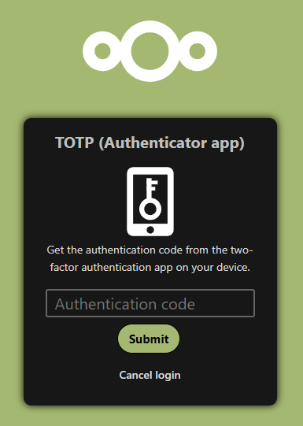
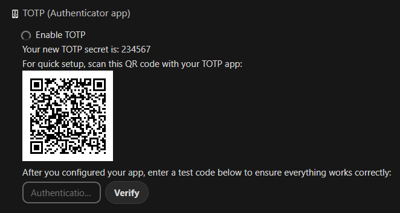
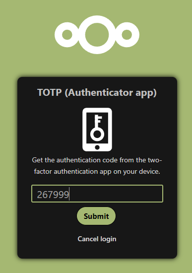

[[ 🡅 Move up ]](../)</br>
[[ 🡄 Previous ]](../01_Puck/) **02: Leshy** [[ Next 🡆 ]](../03_Baba%20Yaga/)

# ☆ Leshy, the Tracker ☆

> Leshy is a forest spirit who has an intimate knowledge of the forest and its inhabitants. His job is to lead the team to the locations where the fern flower grows and to keep a watchful eye on any unwanted visitors who may threaten their mission.

## Exploitation

### Briefing

> As a member of Midsummer Corp with exceptional skills in tracking the fern flower, Leshy's account is protected by another layer of defense – multi-factor authentication. To get access to valuable information about the possible location of the fern flower and ways to track it, you will have to bypass this security measure. 
>
> **How does MFA work?** </br>
> Multi-factor authentication (MFA) is a security measure that uses multiple forms of authentication to verify a user's identity. The idea behind MFA is to increase the security of online accounts and prevent unauthorized access. Even if an attacker manages to obtain a user's password, they will not be able to gain access without also possessing the other required authentication factors. 
>
> **Common MFA issues** </br>
> MFA is more secure than single-factor authentication and for good reason. However, like any additional feature, it increases the attack surface and can introduce new vulnerabilities into the system. 
>
> Sometimes the problem lies in the logic of the process itself. For example, after logging in with a login and password, a user may be redirected to a page that asks for their MFA code, but the valid session has already been issued. In this case, the user can simply go to another page without providing the MFA code and be fully logged in. 
>
> Another issue to consider is the security of the MFA codes themselves. It is crucial that MFA codes are not easily guessable and can resist brute force attacks. They should be randomly generated and unique to each user. 
>
> When an application requires MFA codes for different operations (for example, to log in and to confirm a wire transfer), the codes should be bound to each operation. It should not be possible to use the code provided to confirm a wire transfer to log in to the account. 
>
> **Useful resources**
> - [Multifactor Authentication - OWASP Cheat Sheet Series](https://cheatsheetseries.owasp.org/cheatsheets/Multifactor_Authentication_Cheat_Sheet.html)

**Prerequisites**: Access to any account. </br>
**Your objective**: Find a way to log in to the `leshy` account. MFA code brute-force is not required.

### Reconnaissance
Based on the Briefing, we need two pieces on information to gain access into Leshy's account - theirs password and MFA code.

While scavenging through the previously discovered hidden file [`inbox.mbox`](../01_Puck/inbox.mbox) on Puck's account we can find Leshy's password with ease:

```
From MAILER-DAEMON Wed Aug  21 16:57:34 2023
From: Leshy <leshy@midsummer.corp.local>
To: Puck <puck@midsummer.corp.local>
Subject: Request to Take Care of Groupware Account During Vacation

Dear Puck,

(...)

To make things easier for you, I have attached the login credentials for my groupware account to this email: leshy:nQRbhRyxuDuU9GNd Please keep this information confidential and do not share it with anyone else.

(...)

Best regards,
Leshy
```

That was quite unexpected.

Trying to log in into theirs account will hovewer prompt us to enter the MFA code, just as expected.



How can we circumvent that?

While fiddling around with Puck's account I noticed that I'm able to setup MFA to theirs account as well. During the setup process I stumbled across something concerning - the MFA secret, `234567`, didn't seem random at all.



I restarted the MFA setup process - secret was still the same. It might be the case the server is still using the previously generated code for this account, which is a red flag already, but just to confirm my suspisions I decided to terminate the current VM and setup a new one - **the secret was still the same**.

### Attack Vector

MFA secret not being randomised across user-accounts (not even between MFA setup attempts).

### Execution

The plan is simple - first we need to setup the MFA on Puck's account using any of the Authenticator apps available on the market. After that is done, we simply login using the credentials leaked in the email and provide the MFA code for Puck's account. Since the MFA secret is the same for every user, all of them share the same code at any given time.



And we are in!

## Prevention

When dealing with MFA you should always make sure that MFA secrets are unique between each user or even better - between each setup attempt. Reasoning is simple - if two users share the same secrets they will have the same MFA codes at the same time.

Also, as a note, never send passwords in emails, this screams 'insecurity' as much as `HTTP`.

## Tasks

### What is the length of the MFA code used in the application?

`6`

Pretty much the standard length for a general MFA code. Can be confirmed after setting up MFA on Puck's account.

### What is the content of the file Fern_flower_ritual_shard2.txt in Leshy's account?

`Midsummer_Corp{Fo11ow_Th3_Wi1l_o'_7h3_W1sps}`

Found in the account's files.

</br>
</br>
</br>

[[ 🡅 Move up ]](../)</br>
[[ 🡄 Previous ]](../01_Puck/) **02: Leshy** [[ Next 🡆 ]](../03_Baba%20Yaga/)