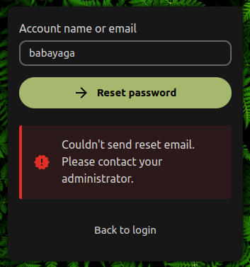

[[ 🡅 Move up ]](../)</br>
[[ 🡄 Previous ]](../02_Leshy/) **03: Baba Yaga** [[ Next 🡆 ]](../04_Boruta/)

# ☆ Baba Yaga, the Researcher ☆

> Baba Yaga is an expert in dark magic and is responsible for researching and discovering new ways to harness the power of the fern flower for the company's purposes. Her extensive knowledge of spells and potions makes her an invaluable member of the team. 

## Exploitation

### Briefing

> During the password reset process, a random token is sent to an email address linked to an account. Usually, this token is relatively long and has high entropy to protect a user from brute-force attacks. But the password reset process can be abused by more than just brute forcing the token. For example, what if the server does not check the validity of the token at all? 
>
> "Piece of cake" – you might think but hold your horses for just a second. As an old lady, Baba Yaga does not like to live in a hurry. To prevent excessive traffic, she implemented a rate limiting on the password reset endpoint. An anonymous user cannot submit any requests from an external network due to strict rate limiting controls. You will probably need to find a way to bypass rate limiting and send an unlimited number of requests to complete this section. 
>
> **Rate limiting bypass** </br>
> While there are many ways to bypass rate limiting, by far the most popular one is to inject HTTP headers into the request that spoof the originating IP address.  Some of the headers used to do so are listed below:
> - X-Originating-IP: 127.0.0.1 
> - X-Forwarded-For: 127.0.0.1 
> - X-Remote-IP: 127.0.0.1 
> - X-Remote-Addr: 127.0.0.1 
> - X-Client-IP: 127.0.0.1 
> - X-Host: 127.0.0.1 
> - X-Forwared-Host: 127.0.0.1 
>
> Is Baba Yaga foolish enough to think you will not be able to find a way around her ingenious invention? There's only one way to find out. 
>
> Beware! Baba Yaga used her powerful skills and managed to take down the Corp's server client. As a result, you won't be able to receive the password reset emails! Nevertheless, your goal is to gain access to the babayaga account by bypassing the password reset process.
>
> **Useful resources** </br>
> - [Rate Limit Bypass - HackTricks](https://book.hacktricks.xyz/pentesting-web/rate-limit-bypass)
> - [Forgot Password - OWASP Cheat Sheet Series](https://cheatsheetseries.owasp.org/cheatsheets/Forgot_Password_Cheat_Sheet.html)
> - [WSTG: Testing for Weak Password Change or Reset Functionalities | OWASP Foundation](https://owasp.org/www-project-web-security-testing-guide/latest/4-Web_Application_Security_Testing/04-Authentication_Testing/09-Testing_for_Weak_Password_Change_or_Reset_Functionalities)

**Prerequisites**: None. </br>
**Your objective**: Find a way to log in to the `babayaga` account. Password token brute-force is not required.

### Reconnaissance

Briefing indicated we will have to somehow exploit the password reset system. However, we won't be able to receive the password reset link (or a newly generated password) since the server responsible for that is down.

Moreover, we will have to deal with rate limiting along the way, but we will worry about it when we get to that.

Let's start by trying to reset the password of `babayaga` account. On the login page, we can try the `Forgot password?` option and enter Baba Yaga's account name (which is simply `babayaga`).



However, we get hit by an error, pretty general one in fact. We could suspect it has something to do with aforementioned rate limiting but it's always better to make sure.

When dealing with web stuff, it's always a good idea to check the Network tab in Dev Tools to gain insight on how different systems in the application work.

Selecting the request in the Network tab allows us to see the Status Code:

```
429 Too Many Requests
```

Aha, so it's rate limiting after all.

There are two ways to figure out how to get around this:
- **The Boring** - try all the headers from the Briefing and see which one works.
- **The Painful** (you need to read PHP code) - search for the header used to enforce the rate limit within the code.

First route shows us that spoofing the `X-Forwarded-For` header does the trick. If you're interested how the second route plays out, I have explained it below.

<details>
<summary>The Painful Route</summary>
</br>
This is where we will start delving into the source code of the application.

For starters, the application utilizes MVC design pattern, storing all the endpoint logic in the Controller files, alongside with `routes.php` files defining all the available routes and what methods should they invoke when the corresponding endpoint is being accessed.

By looking around the application files we can find the `RateLimitingMiddleware.php` which is responsible for - you guessed it - rate limiting certain endpoints.

Inside, we can find the `beforeController` method, which in this framework is invoked before the appropriate Controller logic (based on endpoint selected) kicks in.

```PHP
$requestPath = $this->request->getPathInfo();
$LIMIT_PATHS = ["/lostpassword/email", "/lostpassword/reset/form", "/lostpassword/set"];

foreach($LIMIT_PATHS as $path) {
    if(str_starts_with($requestPath, $path)) {
        $IP = $this->request->getHeader("X-Forwarded-For");
        if(stripos($IP, '.') === false) {
                $IP = "1.3.3.7";
                $anonLimit = 0;
        }
        else {
                $anonLimit = 99999999;
        }

        // (...)
    }

    // (...)
}
```

Clearly, the function cares only about the `X-Forwarded-For` header and whether or not it contains a single period, when it comes to rate limiting. Thus, we can even set this header to `.` and we will pass through the rate limiting functionality.
</details>

To spoof the header we can use a browser extension, such as [ModHeader](https://modheader.com/), which allows us to add and override headers from the comfort of the browser. Simply setting the value to `127.0.0.1` does the trick.

Now that rate limiting is (hopefully) dealt with, let's try resetting the password one more time.


Hovewer, as noted before, we won't receive any password reset link, so there must be another way to exploit this system.

Using the Network tab again, we can select the password reset request to see the following:

```JSON
// Payload
{
    "user": "babayaga"
}

// Response
{
    "status": "success",
    "success_path": "/lostpassword/reset/form/<TOKEN>/<USER>"
}
```

Just by looking at it we can see that `success_path` refers to a URI, probably the one we should receive in an email that just got sent (given that the server isn't down like in our case).

We know the username we should use to substitute the `<USER>` part, but what about the `<TOKEN>`? Well, briefing hints that the token might simply not be checked for validity, so let's navigate to the URI substituting random token as `<TOKEN>`.

```
/lostpassword/reset/form/123/babayaga
```

... and that worked, woah. Seems like the server doesn't care about the token after all. We just found a vulnerability.

### Attack Vector

Faulty (or missing) logic behind checking if the token provided in the password link is valid.

### Execution

We are literally one step from gaining access to Baba Yaga's account. To exploit the vulnerability, all we need to do is to navigate to the previously discovered URI (remember to spoof the `X-Forwarder-For` header). Then, we can enter the new desired password for `babayaga` and reset it.


With password changed, we can enter the new credentials and successfully log into Baba Yaga's account.

## Prevention

When dealing with actions that could alter the user account settings it's critical to ensure that the logic behind the system works as expected.

In this stage the problem boiled down to not checking whether the `<TOKEN>` is valid or not. This enables every user and even an anonymous client to reset any  account's password, at their own discretion.

Generated password-reset tokens should, for example, be stored in the database, and have a short lifetime associated with them. After being used, tokens should be simply disposed.

## Tasks

### What is the endpoint path for resetting a password?

<details>
<summary>Answer</summary>

`/lostpassword/reset/form/<TOKEN>/<USER>`

</details>

Found when requesting to reset the password for any given account (after bypassing the rate limiting).

### What is the content of the Fern_flower_ritual_shard3.txt file in babayaga account?

<details>
<summary>Fern_flower_ritual_shard3.txt</summary>

`Midsummer_Corp{F1nd_th3_cl34r1ng_w1th_th3_anc13nt_st0n3s}`

</details>

Found in the account's files.

</br>
</br>
</br>

[[ 🡅 Move up ]](../)</br>
[[ 🡄 Previous ]](../02_Leshy/) **03: Baba Yaga** [[ Next 🡆 ]](../04_Boruta/)